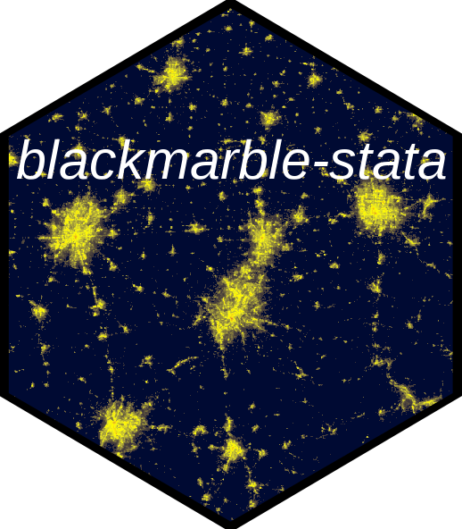
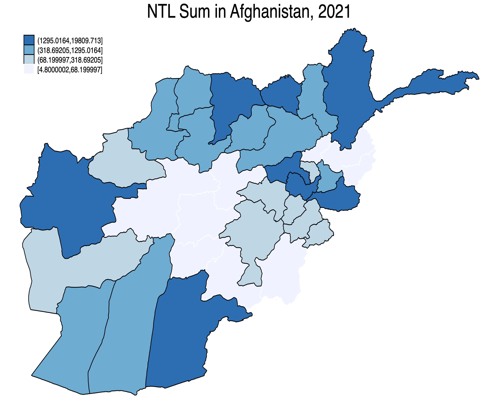

# BlackMarble-Stata 

**BlackMarble-Stata** is a Stata package that provides a simple way to query nighttime lights data from NASA's Black Marble that have been pre-aggregated to administrative boundaries. [Black Marble](https://blackmarble.gsfc.nasa.gov) is a [NASA Earth Science Data Systems (ESDS)](https://www.earthdata.nasa.gov) project that provides a product suite of daily, monthly and yearly global [nighttime lights](https://www.earthdata.nasa.gov/topics/human-dimensions/nighttime-lights). 

* [Install and update](#install)
* [Summary of functions](#functions)

## Install and update <a name="install"></a>

```stata
net install blackmarble, from("https://raw.githubusercontent.com/worldbank/blackmarble-stata/main/src") replace
```

## Summary of functions <a name="functions"></a>

| Command | Description |
| --- | --- |
| [query_bm]() | Query BlackMarble nighttime lights data aggregated at the administrative unit level |
| [query_shp]() | Query the shapefile of the administrative unit used for aggregations |
| [query_geojson]() | Query the shapefile of the administrative unit used for aggregations |

## Usage: Query aggregated dataset of nighttime lights <a name="usage_query_bm"></a>

The `query_bm` function allows querying aggregated nighttime lights using different administrative datasets and different administrative levels. The function has the following parameters:

_Parameters:_

* __geo_dataset:__ Geographic dataset for aggregating nighttime lights. Options include:
  - __GADM (version 4.10) ["gadm_410"]:__ [Database of Global Administrative Areas](https://gadm.org/)
  
* __adm_level:__ Administrative level. Includes "ADM_0" through "ADM_2".

* __iso:__ ISO Country code(s). Can input multiple if interested in a dataset of multiple countries.

* __date_unit:__ Either "annual", "monthly", or "daily".

* __date_start:__ The start date to query nighttime lights. For annual, the format is YYYY (eg, "2012"); for monthly, the format is YYYY-MM (e.g., "2012-01"); for daily, the format is YYYY-MM-DD (e.g., "2012-01-01").

* __date_end:__ The end date to query nighttime lights. For annual, the format is YYYY (eg, "2025"); for monthly, the format is YYYY-MM (e.g., "2015-01"); for daily, the format is YYYY-MM-DD (e.g., "2025-01-01").

* __file_name:__ File name to export dataset of nighttime lights.

_Example input:_

```stata
query_bm, geo_dataset("gadm_410") ///
          adm_level("ADM_1") /// 
          iso("AFG AGO AIA") ///
          date_unit("annual") ///
          date_start("2012") ///
          date_end("2022") ///
          file_name("~/Desktop/ntl_dataset.dta")
```

_Output:_

The function creates a dataset and folder with individual files that are used to construct the exported dataset. For example, the above function creates:

* __ntl_dataset.dta:__ Dataset of nighttime lights
* __ntl_dataset_dta_individual_files:__ Folder with all individual files used to create the dataset of nighttime lights. There is a separate file for each country and each date. If the `query_bm` function is run again, the function will check this folder to see which files have already been downloaded and will only downloaded files that have yet to be download. For example, if the function is run and the `date_end` later changed---such as changing `date_end` to `"2023"`, then the function will only download data for 2023.

The __ntl_dataset.dta__ dataset contains the following variables about nighttime lights:

* __ntl_sum:__ Sum of nighttime lights in the administrative unit.
* __ntl_mean:__ Mean of nighttime lights in the administrative unit.
* __ntl_median:__ Median of nighttime lights in the administrative unit.
* __prop_na:__ Proportion of values in the administrative unit that are `NA`. For example, a value may be set to `NA` is the pixel was covered by clouds.
* __prop_quality_0:__ Proportion of values in the administrative unit classified as quality 0 (see below for quality classification descriptions)
* __prop_quality_1:__ Proportion of values in the administrative unit classified as quality 1 (see below for quality classification descriptions)
* __prop_quality_2:__ Proportion of values in the administrative unit classified as quality 2 (see below for quality classification descriptions)

The following are quality classifications:

* For __daily__ data:
    * `0`: High-quality, Persistent nighttime lights
    * `1`: High-quality, Ephemeral nighttime Lights
    * `2`: Poor-quality, Outlier, potential cloud contamination, or other issues

* For __monthly and annual__ data:
  * `0`: Good-quality, The number of observations used for the composite is larger than 3
  * `1`: Poor-quality, The number of observations used for the composite is less than or equal to 3
  * `2`: Gap filled NTL based on historical data

## Usage: Query spatial files <a name="usage_query_spatial"></a>

The package also enables querying the spatial files used for aggregation. `query_shp` can be used to download a shapefile and `query_geojson` can be used to download a geojson.

```stata
* Download shapefile
query_shp, geo_dataset("gadm_410") adm_level("ADM_1") iso("AFG") ///
           file_name("~/Desktop/afg_adm1.shp")

* Download geojson
query_geojson, geo_dataset("gadm_410") adm_level("ADM_1") iso("AFG") ///
               file_name("~/Desktop/afg_adm1.geojson")
```

## Usage: Make a map of nighttime lights <a name="usage_make_map"></a>

The below example illustrates making a map of nighttime lights. This approach requires querying both nighttime lights data and a spatial file

```stata
* Example of Making a Map

clear all

* Install packages -------------------------------------------------------------
* net install blackmarble, from("https://raw.githubusercontent.com/worldbank/blackmarble-stata/main/src") replace
* ssc install spmap, replace      // Install spmap if not already installed
* ssc install shp2dta, replace    // Install shp2dta if not already installed

* Download data ----------------------------------------------------------------
query_bm, geo_dataset("gadm_410") /// 
          adm_level("ADM_1") ///
          iso("AFG") ///
          date_unit("annual") ///
          date_start("2021") ///
          date_end("2021") ///
          file_name("~/Desktop/afg_annual_2021.dta")
						  
query_shp, geo_dataset("gadm_410") adm_level("ADM_1") iso("AFG") file_name("~/Desktop/afg_adm1.shp")

* Prep data for map ------------------------------------------------------------

* Load NTL data
use "~/Desktop/afg_annual_2021.dta", clear

* Convert Shapefile to Stata Format
shp2dta using "~/Desktop/afg_adm1.shp", database(afg_db) coordinates(afg_coord) genid(id) replace

* Load the shapefile attribute data
use afg_db, clear

* Merge with your Stata dataset on GID_1
merge 1:1 GID_1 using "~/Desktop/afg_annual_2021.dta"

* Drop merge indicator if needed
drop _merge

* Make map ---------------------------------------------------------------------

* Generate the map
spmap ntl_sum using afg_coord, id(id) fcolor(Blues) ocolor(white) \\\
                               clmethod(quantile) \\\
                               title("NTL Sum in Afghanistan, 2021") \\\
                               legend(position(11))
    
* Save the map as a PNG file
graph export "~/Desktop/afg_ntl_map.png", replace width(2000) height(1600)
```

<p align="center">

</p>
