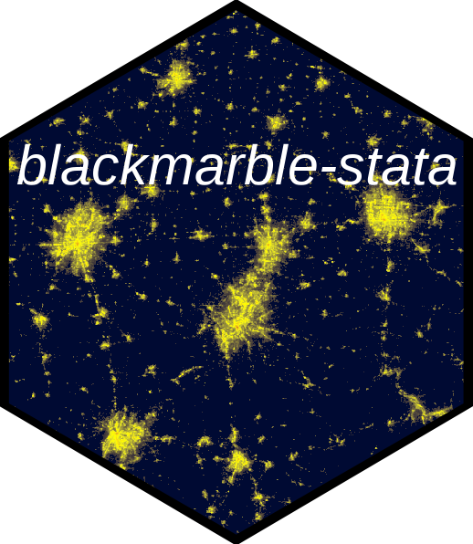

# BlackMarble-Stata 

**BlackMarble-Stata** is a Stata package that provides a simple way to query nighttime lights data from NASA's Black Marble that have been pre-aggregated to administrative boundaries. [Black Marble](https://blackmarble.gsfc.nasa.gov) is a [NASA Earth Science Data Systems (ESDS)](https://www.earthdata.nasa.gov) project that provides a product suite of daily, monthly and yearly global [nighttime lights](https://www.earthdata.nasa.gov/topics/human-dimensions/nighttime-lights). 

* [Install and update](#install)
* [Summary of functions](#functions)

## Install and update <a name="install"></a>

```stata
net install blackmarble, from("https://raw.githubusercontent.com/worldbank/blackmarble-stata/main/src") replace
```

## Summary of functions <a name="functions"></a>

| Command | Description |
| --- | --- |
| [query_bm]() | Query BlackMarble nighttime lights data aggregated at the administrative unit level |
| [query_shp]() | Query the shapefile of the administrative unit used for aggregations |
| [query_geojson]() | Query the shapefile of the administrative unit used for aggregations |

## Usage: Query aggregated dataset of nighttime lights <a name="usage_query_bm"></a>

The `query_bm` function allows creating a dataset of Black Marble nighttime lights for different administrative units over time. The [input](#input_query_bm) section describes different inputs to the function, and the [output](#output_query_bm) describes the nighttime light variables in the produced dataset; variables included aggregated nighttime lights, and diagnostic variables to determine the quality of nighttime lights.

#### Input: Using `query_bm` <a name="input_query_bm"></a>

The `query_bm` function allows querying aggregated nighttime lights using different administrative datasets and different administrative levels. The function has the following parameters:

_Parameters for geographic dataset to aggregate to_

* __geo_dataset:__ Geographic dataset for aggregating nighttime lights. Options include:
  - __GADM (version 4.10) ["gadm_410"]:__ [Database of Global Administrative Areas](https://gadm.org/)
  
* __adm_level:__ Administrative level. Includes "ADM_0" through "ADM_2".

* __iso:__ ISO Country code(s). Can input multiple if interested in a dataset of multiple countries.

_Variables for nighttime lights_

* __date_unit:__ Either "annual", "monthly", or "daily".
* __date_start:__ The start date to query nighttime lights. For annual, the format is YYYY (eg, "2012"); for monthly, the format is YYYY-MM (e.g., "2012-01"); for daily, the format is YYYY-MM-DD (e.g., "2012-01-01").
* __date_end:__ The end date to query nighttime lights. For annual, the format is YYYY (eg, "2025"); for monthly, the format is YYYY-MM (e.g., "2015-01"); for daily, the format is YYYY-MM-DD (e.g., "2025-01-01").

```stata
query_bm, geo_dataset("gadm_410") ///
          adm_level("ADM_1") /// 
          iso("AFG AGO AIA") ///
          date_unit("annual") ///
          date_start("2012") ///
          date_end("2023") ///
          file_name("~/Desktop/ntl_dataset.dta")
```

#### Output <a name=output_query_bm"></a> 

DATASET

INDIVIDUAL FILES (if want to update the dataset later on)

## Usage: Query spatial files <a name="usage_query_spatial"></a>

The package also enables querying the spatial files used for aggregation. `query_shp` can be used to download a shapefile and `query_geojson` can be used to download a geojson.

```stata
* Download shapefile
query_shp, geo_dataset("gadm_410") adm_level("ADM_1") iso("AFG") ///
           file_name("~/Desktop/afg_adm1.shp")

* Download geojson
query_geojson, geo_dataset("gadm_410") adm_level("ADM_1") iso("AFG") ///
               file_name("~/Desktop/afg_adm1.geojson")
```

## Usage: Make a map of nighttime lights <a name="usage_make_map"></a>

The below example illustrates making a map of nighttime lights. This approach requires querying both nighttime lights data and a spatial file

```stata
* Example of Making a Map

clear all

* Install packages -------------------------------------------------------------
* net install blackmarble, from("https://raw.githubusercontent.com/worldbank/blackmarble-stata/main/src") replace
* ssc install spmap, replace      // Install spmap if not already installed
* ssc install shp2dta, replace    // Install shp2dta if not already installed

* Download data ----------------------------------------------------------------
query_bm, geo_dataset("gadm_410") /// 
          adm_level("ADM_1") ///
          iso("AFG") ///
          date_unit("annual") ///
          date_start("2021") ///
          date_end("2021") ///
          file_name("~/Desktop/afg_annual_2021.dta")
						  
query_shp, geo_dataset("gadm_410") adm_level("ADM_1") iso("AFG") file_name("~/Desktop/afg_adm1.shp")

* Prep data for map ------------------------------------------------------------

* Load NTL data
use "~/Desktop/afg_annual_2021.dta", clear

* Convert Shapefile to Stata Format
shp2dta using "~/Desktop/afg_adm1.shp", database(afg_db) coordinates(afg_coord) genid(id) replace

* Load the shapefile attribute data
use afg_db, clear

* Merge with your Stata dataset on GID_1
merge 1:1 GID_1 using "~/Desktop/afg_annual_2021.dta"

* Drop merge indicator if needed
drop _merge

* Make map ---------------------------------------------------------------------

* Generate the map
spmap ntl_sum using afg_coord, id(id) fcolor(Blues) ocolor(white) clmethod(quantile) title("NTL Sum in Afghanistan, 2021")
    
* Save the map as a PNG file
graph export "~/Desktop/afg_ntl_map.png", replace width(2000) height(1600)
```

<p align="center">

</p>
